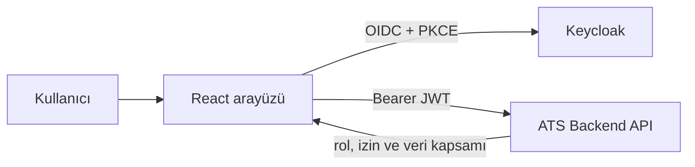

# ATS Frontend

ATS Frontend; adayların, ilk temas kayıtlarının, açık pozisyonların ve işe alım süreçlerinin tek bir arayüzden yönetilmesini sağlayan React tabanlı web uygulamasıdır. Kimlik doğrulama Keycloak üzerinden yapılır; kullanıcının görebileceği menüler ve veriler backend tarafından döndürülen rol, izin, şirket ve departman kapsamına göre belirlenir.

> Backend deposu: [elifnurbeycan/ats-system](https://github.com/elifnurbeycan/ats-system)

## Ekran görüntüsü


## Öne çıkan özellikler

- Aday, pozisyon, departman ve işe alım süreci yönetimi
- Departman bazlı iletişim havuzu ve aday dönüşüm takibi
- Tarih aralığı, sütun, durum ve departman filtreleri
- Kontrol panelinde dönemsel metrikler ve Recharts grafikleri
- Aday profilinde notlar, görüşmeler, süreç geçmişi ve aşama bazlı değerlendirmeler
- Rol ve izinlere göre menü ve işlem görünürlüğü
- Şirket ve departman kapsamına göre veri izolasyonu
- Platform yöneticisi için şirket yönetim ekranları
- Excel dışa aktarımı ve formül enjeksiyonuna karşı hücre temizleme
- Açık/koyu tema, duyarlı yerleşim ve Türkçe arayüz
- Keycloak SSO, PKCE ve bellekte tutulan erişim belirteçleri

## Teknoloji yığını

| Alan              | Teknoloji                    |
| ----------------- | ---------------------------- |
| Arayüz            | React 19, TypeScript, Vite 7 |
| Stil              | Tailwind CSS 4, Radix UI     |
| Yönlendirme       | Wouter                       |
| Form ve doğrulama | React Hook Form, Zod         |
| Grafik            | Recharts                     |
| Tarih             | date-fns, React Day Picker   |
| HTTP              | Axios                        |
| Kimlik doğrulama  | Keycloak JS                  |
| Birim testi       | Vitest                       |
| Uçtan uca test    | Playwright                   |

## Mimari



Başlıca kaynak dizinleri:

```text
client/src/
├── components/   # Ortak arayüz bileşenleri ve ana yerleşim
├── contexts/     # Tema gibi uygulama bağlamları
├── hooks/        # Yeniden kullanılabilir React hook'ları
├── lib/          # API istemcileri, Keycloak, izin ve yardımcı araçlar
└── pages/        # Sayfa bileşenleri
e2e/              # Playwright senaryoları
server/           # Production statik sunucu girişi
shared/           # Paylaşılan tip ve sabitler
```

## Gereksinimler

- Node.js 20 veya üzeri
- pnpm 10
- Çalışan ATS Backend (`http://localhost:8080`)
- Çalışan Keycloak (`http://localhost:8081`)

## Kurulum

```powershell
git clone https://github.com/elifnurbeycan/ats-system-frontend.git
cd ats-system-frontend
Copy-Item .env.example .env
pnpm install
pnpm dev
```

Uygulama varsayılan olarak [http://localhost:3000](http://localhost:3000) adresinde açılır.

Keycloak ile gerçek oturum açma için `.env` dosyasında aşağıdaki değeri etkinleştirin:

```dotenv
VITE_KEYCLOAK_ENABLED=true
```

## Ortam değişkenleri

| Değişken                  | Açıklama                     | Varsayılan örnek        |
| ------------------------- | ---------------------------- | ----------------------- |
| `VITE_API_URL`            | Backend API adresi           | `http://localhost:8080` |
| `VITE_KEYCLOAK_ENABLED`   | Keycloak entegrasyonunu açar | `false`                 |
| `VITE_KEYCLOAK_URL`       | Keycloak sunucu adresi       | `http://localhost:8081` |
| `VITE_KEYCLOAK_REALM`     | Uygulama realm'i             | `ats`                   |
| `VITE_KEYCLOAK_CLIENT_ID` | Public frontend istemcisi    | `ats-frontend`          |

Gerçek `.env` dosyası Git'e gönderilmez. İstemci tarafındaki `VITE_*` değerlerinin tarayıcı paketine dahil edildiğini unutmayın; bu değişkenlere parola veya client secret yazmayın.

## Komutlar

| Komut           | Açıklama                              |
| --------------- | ------------------------------------- |
| `pnpm dev`      | Geliştirme sunucusunu başlatır        |
| `pnpm build`    | Production paketini oluşturur         |
| `pnpm preview`  | Oluşturulan paketi yerelde önizler    |
| `pnpm check`    | TypeScript tip kontrolünü çalıştırır  |
| `pnpm test`     | Vitest birim testlerini çalıştırır    |
| `pnpm test:e2e` | Playwright testlerini çalıştırır      |
| `pnpm format`   | Prettier ile kaynakları biçimlendirir |

## Sayfalar

| Yol                | İçerik                            |
| ------------------ | --------------------------------- |
| `/`                | Kontrol paneli                    |
| `/adaylar`         | Aday listesi ve filtreler         |
| `/adaylar/:id`     | Aday profili ve süreç ayrıntıları |
| `/iletisim`        | Departman bazlı ilk temas havuzu  |
| `/pozisyonlar`     | Pozisyon yönetimi                 |
| `/departmanlar`    | Departman yönetimi                |
| `/ise-alim-sureci` | İşe alım panosu ve aşamalar       |
| `/kullanicilar`    | Şirket kullanıcıları              |
| `/roller`          | Rol ve izin yönetimi              |
| `/ayarlar`         | Kullanıcı ve şirket ayarları      |
| `/admin`           | Platform yöneticisi şirket ekranı |

## Yetkilendirme yaklaşımı

Frontend, kullanıcı deneyimi için menüleri ve butonları rol/izin bilgisine göre gösterir. Bu kontroller güvenlik sınırı değildir. Asıl yetkilendirme, şirket ve departman veri kapsamı dahil olmak üzere backend üzerinde uygulanır.

Desteklenen temel roller arasında `SUPER_ADMIN`, `COMPANY_ADMIN`, `HR`, `RECRUITER`, `GENERAL_MANAGER`, `DEPARTMENT_MANAGER`, `HIRING_MANAGER` ve `INTERVIEWER` bulunur. Ekran erişimi ayrıca backend'den gelen ayrıntılı izin kodlarıyla daraltılır.

## Testler

```powershell
pnpm check
pnpm test
pnpm test:e2e
pnpm build
```

Mevcut test kapsamı; Excel hücre güvenliği, korunan sayfaların Keycloak'a yönlendirilmesi ve eski oturum toplama endpoint'inin kapalı olması gibi kritik akışları içerir.

## Güvenlik notları

- Kimlik doğrulama Authorization Code + PKCE akışıyla Keycloak üzerinden yapılır.
- Erişim ve yenileme belirteçleri `localStorage` veya `sessionStorage` içine kopyalanmaz.
- API istekleri `Authorization: Bearer <token>` başlığıyla gönderilir.
- Excel dışa aktarımında formül olarak yorumlanabilecek değerler güvenli hale getirilir.
- Depo yalnızca `.env.example` içerir; gerçek ortam dosyaları commit edilmemelidir.
- Tenant ve departman izolasyonu yalnızca arayüzde değil, backend sorgu ve güvenlik katmanında uygulanmalıdır.

## Lisans

Bu proje `package.json` içinde MIT lisanslı olarak tanımlanmıştır.
